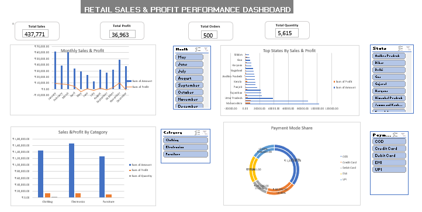

# Retail Sales Analysis using Excel

## Project Overview

This project analyzes retail sales data using Microsoft Excel to identify sales, profit, quantity, and product performance patterns.

## Business Objective

The objective is to analyze retail transactions and generate meaningful business insights using Excel-based data analysis and visualization.

## Dataset

The project uses two related datasets:

- Orders dataset — 500 records
- Details dataset — 1,500 records
- Common field — Order ID

Key fields include:
- Order Date
- Customer Name
- State
- City
- Amount
- Profit
- Quantity
- Category
- Sub-Category
- Payment Mode

## Analysis Performed

- Calculated total sales amount
- Analyzed total profit
- Analyzed total quantity
- Compared categories and sub-categories
- Analyzed sales by state and city
- Analyzed payment methods
- Created PivotTables
- Created charts and slicers
- Built an interactive Excel dashboard

## Key Metrics

- Total Amount: 437,771
- Total Profit: 36,963
- Total Quantity: 5,615

## Dashboard

An interactive Excel dashboard was created using PivotTables, charts, and slicers to present the analysis clearly.

## Tools Used

- Microsoft Excel
- PivotTables
- PivotCharts
- Slicers
- Data Analysis

## Project File

- `Retail_Sales_Analysis.xlsx` — Complete Excel analysis and dashboard

